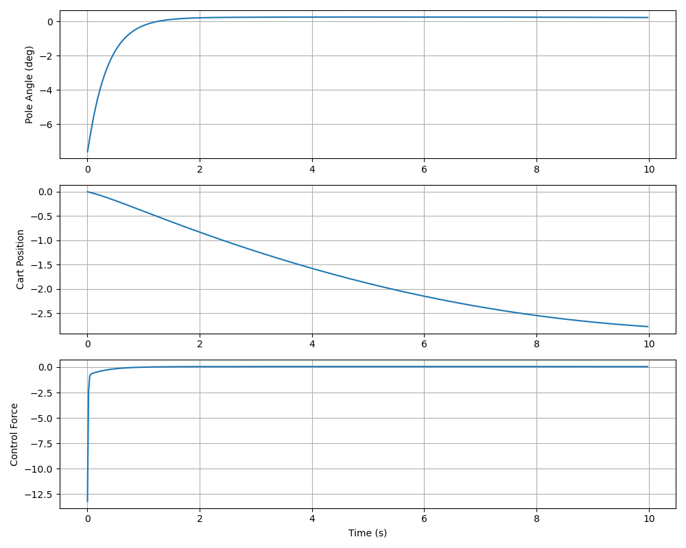

# CartPole MPC Stabilization

Model Predictive Control implementation for stabilizing an inverted pendulum (cart-pole) system.

---

## 📁 Project Structure

```

hyperever-task-1/
├── src/ # Source code (CartPole, MPC, MainWindow, Simulation)
├── build/ # Build directory (generated)
├── run_simulation.sh # One-click build and run
├── plot_results.py # Generate result plots
├── CMakeLists.txt # Build configuration
│
├── design_report.pdf # MPC design and technical details
├── project_report.pdf # Full project documentation
├── mpc_results.png # Example output visualization
└── mpc_data.csv # Logged simulation data

```

---

## 📚 Documentation

| File                   | Description                                           |
| ---------------------- | ----------------------------------------------------- |
| **design_report.pdf**  | MPC formulation, physics model, design decisions      |
| **project_report.pdf** | Implementation details, results, performance analysis |
| **mpc_results.png**    | Sample plots showing stabilization behavior           |

---

## 🔧 Dependencies

```bash
# Install system libraries
sudo apt-get install libsfml-dev libeigen3-dev cmake

# Install Python packages (for plotting)
pip install matplotlib pandas
```

---

## 🚀 Quick Start

```bash
# Make script executable
chmod +x run_simulation.sh

# Build, run, and plot
./run_simulation.sh
```

**That's it!** The script handles everything: building, running the simulation, and generating plots.

---

## 🛠️ Manual Build

```bash
# Build
mkdir -p build && cd build
cmake ..
make

# Run
./cartpole_sim

# Plot results
cd .. && python3 plot_results.py
```

---

## 🎮 Controls

- **ESC** - Exit simulation
- **Close Window** - End simulation

---

## 📊 Output Files

**mpc_data.csv**

- Time-series data: time, position, angle, velocities, control force
- Used for post-simulation analysis

**mpc_results.png**

- Three plots: pole angle, cart position, control force vs time
- Shows stabilization performance



---

## ⚙️ System Parameters

**Physical:**

- Cart mass: 1.0 kg
- Pole mass: 0.2 kg
- Pole length: 0.5 m
- Gravity: 9.81 m/s²

**Control:**

- MPC horizon: 30 steps (0.6 seconds)
- Timestep: 0.02s (50 Hz)
- Force limit: ±50 N
- Duration: 10 seconds

**Initial Conditions:**

- Random angle: ±20°
- Position: 0
- All velocities: 0

---

## 📈 Expected Results

- **Stabilization time:** ~2 seconds
- **Final angle:** Near 0° (upright)
- **Cart position:** Minimal drift, near origin
- **Control:** Smooth forces within limits

---

## 📝 License

Academic project for Hyperever Assignment.

```

```
